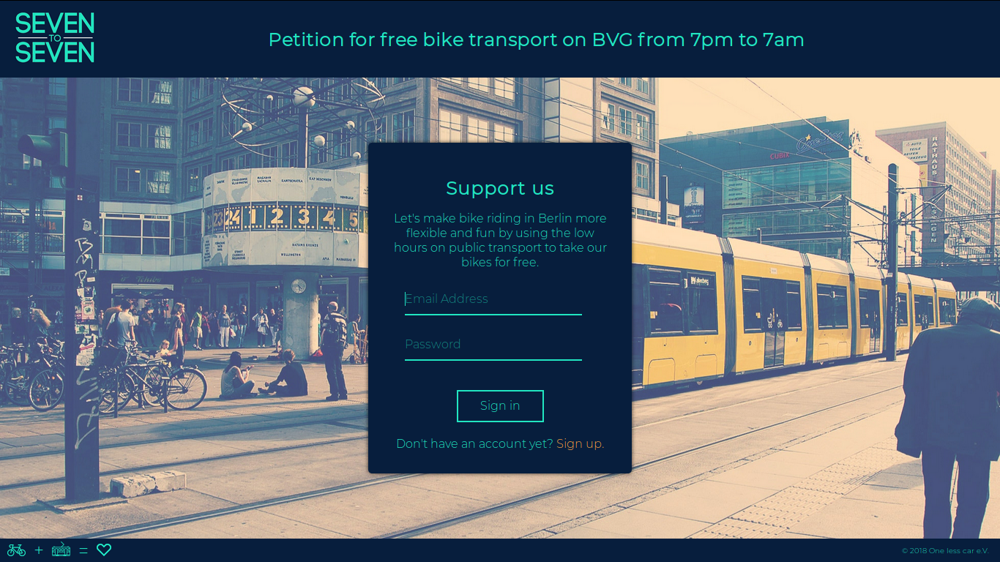
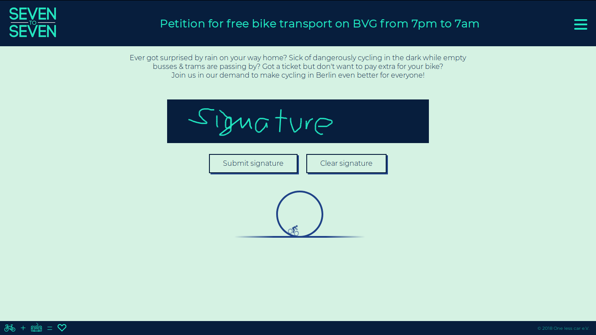
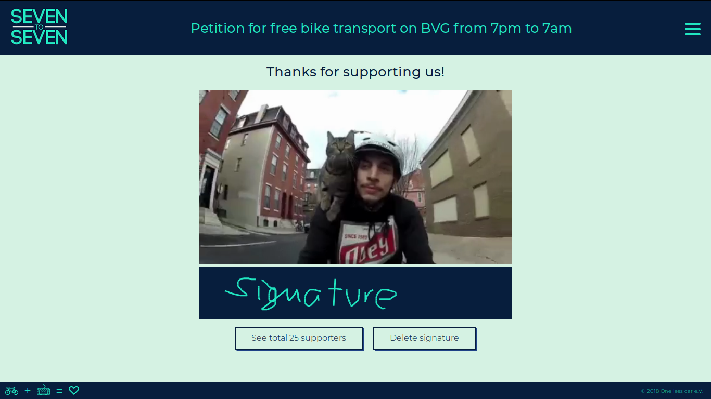
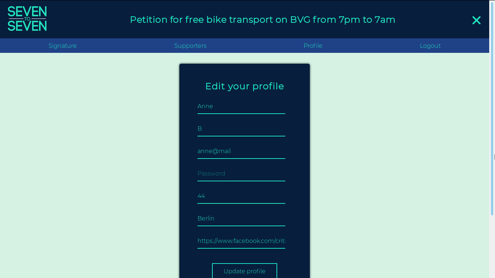

# Petition Website Seven-to-seven

Multi-page website that lets logged-in users sign a petition to make bike transport on BVG (berlin public transport company) free between 7pm and 7am.

Find the live version running under [https://seven2seven.herokuapp.com](https://seven2seven.herokuapp.com).

## Features
* Log into an existing account or register a new one.
* Leave signature on an HTML Canvas.
* See signature after signing, delete signature if needed.
* See other supporters after signing.
* Filter supporters by city.
* Edit or delete profile.
* User password is stored encrypted with bcrypt.
* Mobile-friendly (-ish).

## Technologies
HTML, CSS, JavaScript, jQuery, Handlebars, Node.js, Express, PostgreSQL

## Development
* PostgreSQL database running, edit parameters in [db.js](db.js).
* Run [setup.sql](setup.sql) to initialize tables in database.
* Set `process.env.COOKIE_SECRET` or edit parameter directly in [index.js](index.js).

```
npm install
node index.js
```

## Preview

### login


### sign the petition


### signature


### edit your profile, navigation showing
